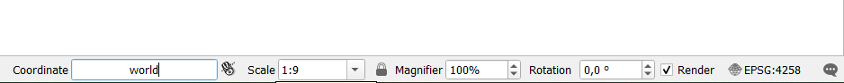
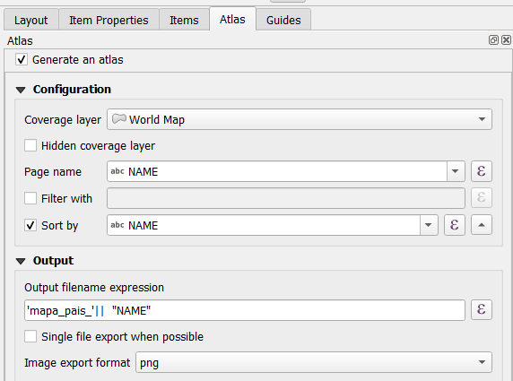
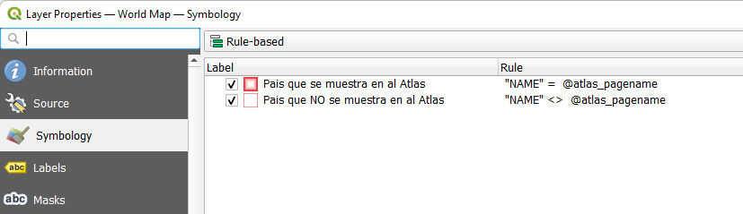

# QGIS --> TALLER ATLAS

# XIX Congreso de TIG - Zaragoza 2022

## RESUMEN
En este taller vamos a ver las posibilidades para crear una composición con la herramienta del atlas.
Herramienta que permite crear multiples mapas a aprtir de una composición y una capa de referencia.

Pasos a seguir
1. Crear un proyecto de QGIS con la capa de paises del mundo
2. Configurar el Atlas
3. Diseñar la composición
4. Simbología basado en reglas

## 1- Cargar la capa de paises del mundo
Para cargar la capa de paises del undo a QGIS hay que escribir "**World**" en las coordenadas de la barra de estado
Huevo de Pascua (Easter egg)

## 2- Configurar el Atlas en la composición
1. Utilizar la capa de coibertura la propia de paises del undo
2. Nombre de página = "**NAME**"

## 3- Diseñar la composición 
Ahora se trata de diseñar la composición, tendremos que añadir los sisguiente elementos:
1. Mapa, controlado por atlas
2. Título, expresión con el nombre del pais
3. Imágen (bandera) ver siguiente apartado

#### Añadir una imagen con la banera de cada pais
Podremos incorporar una imagen con la bandera de cada pasi de esta página web:
- flagpedia.net/data/flags/w580/ca.png.
flagpedia.net/data/flags/w580/ca.png

## 4- Simbolizar el pais que se muestra en el atlas con una simbología diferente:
1. Primero modificar la simbologia en las propiedades de la capa
2. Utilizar el tipo de simbología" Basado en reglas"
3. Crear 2 reglas (pe: "NAME" =  @atlas_pagename )

